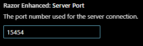

# RazorEnhanced for VS Code

This Code Text extension allows you to control a server running RazorEnhanced, sending commands and receiving responses.

###### Commands

- **RazorEnhanced: Play**: Play the commands in the current file on the server.
- **RazorEnhanced: Stop Playing**: Stop the current play session.
- **RazorEnhanced: Record**: Start recording commands from the current file.
- **RazorEnhanced: Stop Record**: Stop recording commands from the current file.

###### Configuration

If you run multiple copies of RazorEnhanced, each copy will get its own port number.

On the help tab you will find the port that instance of RazorEnhanced is using.

You can configure the server port in the `RazorEnhanced settings`:

- [ ] ctrl-, or click the cog wheel and choose settings

- [ ] In search bar enter RazorEnhanced

- [ ] Razor Enhanced: Server Port provide the port number you wish to connect to

  

##### Contribution

UOS Highlighting courtesy of **cesarsl@duck.com** from his github project: https://github.com/cesarsl/vsc-uosteam.git

